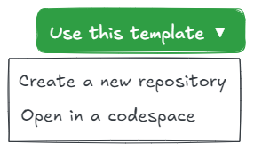

This is a theme template for Obsidian (https://obsidian.md).

# Obsidian Theme Template

This template provides a starting point for creating your own Obsidian theme. It includes the necessary files and structure to help you get started quickly.

## Highlights

- 🪄 Built with Vite, supporting real-time preview of the template effects.
- 💪 Supports the SCSS preprocessor, making it easy to write styles.
- 🗃️ Modular styling for convenient design and maintenance.
- 🫧 Supports the definition of information for the Style Settings plugin, automatically generating Style Settings configuration information in a modular way.
- 🏷️ Supports automatic publishing by creating tags.

## Getting Started



1. **Create a new repository**: Click the "Use this template" button to create a new repository based on this template.
2. **Clone the repository**: Clone your new repository to your local machine using Git.
3. **Install dependencies**: Navigate to the cloned repository directory and run `npm install` to install the necessary dependencies.
4. **Fill in the theme information**:
   - Open `package.json` and fill in basic information such as the theme name, author, and description.
   - Open `src/css/license.css` and fill in the theme's license information.
   - If necessary, update the version information in `versions.json`.  
   - Finally, remember to modify the files under .github/ISSUE_TEMPLATE.
5. **Develop your theme**: Start modifying the CSS files in the `src/scss` directory to create your custom theme.
   - Use the `npm run dev` command to start the development server, so you can preview your theme changes in real-time.
   - Create a symbolic link to map the `test` directory to the `themes` directory in your Obsidian Vault for testing your theme in Obsidian.
   - If needed, you can modify the `.css.md` files in the `src/css/style-settings/` directory. They will generate configuration definitions for the Style Settings plugin for your theme.
   - Whenever you make changes to files in either the `src/scss` or `src/css/style-settings` directories, they will be automatically compiled into `theme.css` in the `test` directory (HMR).
6. **Build the theme**: Run `npm run build` to compile your SCSS files into CSS. This will generate the final theme files in root directory.


## Notes

- During development, it is recommended to use the `npm run dev` command to preview theme changes in real-time.
- The Style Settings configuration adopts a modular design. Each module consists of a `.css.md` file and a directory with the same name. The directory contains a set of configuration files. This theme template supports dynamically reading these configurations during development and compilation, but the final definition information for delivery will be generated based on the order of file names. Therefore, you can add a numeric prefix to each Section.

You can refer to more information in [the official documentation](https://docs.obsidian.md/Themes/App+themes/Build+a+theme)

## Q&A

### Why can't my theme use HMR?

This theme template supports hot module replacement (HMR) from SCSS files to CSS files. If you find that HMR isn't working during development, it could be due to the following reasons:
1. During runtime, the test folder `test` isn't symbolically linked to `.obsidian/themes/<YOUR_THEME_NAME>`.
2. The `manifest.json` file in the runtime test folder `test` isn't configured correctly or has been accidentally deleted.
3. Obsidian doesn't have an HMR plugin installed (such as [obsidian-theme-hot-reload-plugin](https://github.com/mProjectsCode/obsidian-theme-hot-reload-plugin/)) or the plugin isn't enabled.
4. The HMR plugin isn't configured correctly (for example, obsidian-theme-hot-reload-plugin requires manual addition of file monitoring).

### How to disable Style Settings definitions?

The theme template has Style Settings definitions enabled by default. If you don't need to use Style Settings, you can delete all `.css.md` files and their corresponding configuration directories in the `src/css/style-settings/` directory.

### How to Publish Your Theme?

After running `npm run build`, the `theme.css` and `manifest.json` files will be generated in the root directory. Then you can proceed with the publishing process.

There are two methods for publishing:

1. **Manual Publishing**. Publish directly through the GitHub Web UI.
   - Create a new Release on GitHub and upload the `theme.css` and `manifest.json` files.
   - Make sure to include the version number and update details in the Release description.
   - After publishing, users can search for and install your theme through Obsidian's theme settings interface (assuming your theme is on the Obsidian theme gallery).
   - For the steps, please refer to [Obsidian's official theme template release steps](https://github.com/obsidianmd/obsidian-sample-theme?tab=readme-ov-file#steps-for-releasing-new-versions).
2. **Automatic Publishing**. Automatically publish using GitHub Actions. 
   - After you've built your theme, push it to the `main` branch of your GitHub repository and create a tag. GitHub Actions will then automatically run and publish the theme.
   - For specific steps, please refer to the [Obsidian official documentation](https://docs.obsidian.md/Themes/App+themes/Release+your+theme+with+GitHub+Actions).

### How to Modify the `versions.json` File?

In most cases, you don't need to modify this file.

If subsequent versions of your theme require a newer version of Obsidian to achieve the best experience, you can modify this file. The format of the file is as follows:

```json
{
   "1.0.0": "0.16.0",
   "2.0.0": "1.0.0"
}
```

Please note that according to Obsidian's rules, the version numbers used as keys refer to the version numbers of your theme, and the version numbers used as values refer to the version numbers of Obsidian. So if the new version of your theme is only compatible with an Insider version of Obsidian, it's important to set this value accordingly. This will prevent users on older versions of Obsidian from updating to the newer version of your theme.

## Why SCSS

SCSS (Sassy CSS) is an extension language of CSS that significantly enhances the maintainability and development efficiency of stylesheets by introducing variables, nesting, mixins, and other features. Its nested syntax mirrors HTML structure, making code more organized and readable. Variables simplify managing recurring values like colors and fonts, while mixins enable reusable style definitions, reducing redundancy. SCSS also supports mathematical operations, inheritance, modular file management, and control directives for complex logic, all while maintaining full compatibility with CSS, allowing gradual integration into existing projects.

Adopting SCSS streamlines code organization and flexibility, making it ideal for large-scale projects or collaborative teams. Its robust feature set and ecosystem tools (e.g., auto-compilation, code hints) improve developer experience, enabling the creation of cleaner, more maintainable stylesheets.

## Why Vite

Vite is a modern front-end build tool widely chosen for its features that significantly enhance the development experience: it leverages native ES modules and on-demand compilation to achieve sub-second cold starts, offers millisecond-level hot module replacement (HMR), has built-in support for JSX, TS, and CSS preprocessors, boasts a rich plugin ecosystem, supports multiple frameworks like Vue and React, and its production build is optimized via Rollup for code splitting and on-demand loading. Compared to traditional tools (such as Webpack), Vite features simpler configuration and faster startup speeds, making it particularly suitable for rapid iteration in small to medium-sized projects and performance optimization in large-scale projects, and it is an ideal choice for those pursuing efficient development workflows and integration with the modern front-end ecosystem.

## Useful Resources

### Plugins for Theme Development and Design

- [Obsidian Theme Design Utilities](https://github.com/chrisgrieser/obsidian-theme-design-utilities) - Some utilities and Quality-of-Life features for designers of Obsidian themes.
- [My Snippets](https://github.com/chetachiezikeuzor/MySnippets-Plugin) - A plugin that adds a status bar menu allowing the user to quickly manage their snippets within the comfort of their workspace.
- [Theme Picker](https://github.com/trey-sedate/obsidian-theme-picker) - Allows for quick selection of an installed theme without needing to navigate out of the Settings modal.
- [Print Preview](https://github.com/nothingislost/obsidian-print-preview) - [BRAT] Helps theme designers debug export to pdf issues by allowing them to inspect the print results.
- [Theme Hot-Reload](https://github.com/mProjectsCode/obsidian-theme-hot-reload-plugin) - [BRAT] Add a file to hot reload in the plugin settings. The file must be a local file path from within the vault.

### Documentation and Guides

- [Obsidian Theme Documentation](https://docs.obsidian.md/Themes/App+themes/Build+a+theme) - Official documentation for building themes in Obsidian.
- [Overview of Resources and Guides for Theme Designers](https://publish.obsidian.md/hub/04+-+Guides%2C+Workflows%2C+%26+Courses/for+Theme+Designers)
- [Why and How to use Stylelint for your Obsidian Theme](https://publish.obsidian.md/hub/04+-+Guides%2C+Workflows%2C+%26+Courses/Guides/Why+and+How+to+use+Stylelint+for+your+Obsidian+Theme)
- [Want some Sass with your obsidian theme? Here's How and Why](https://publish.obsidian.md/hub/04+-+Guides%2C+Workflows%2C+%26+Courses/Guides/Want+some+Sass+with+your+obsidian+theme%E2%80%BD+here's+How+and+Why)
- [How to Use Obsidian 1.0 CSS Variables](https://www.youtube.com/watch?v=yl0pvIRTWWo)

## Thanks

- [@obsidianmd](https://github.com/obsidianmd/) - I used the GitHub Actions script from Obsidian's official theme template.
- [@kepano and Minimal Theme](https://github.com/kepano/obsidian-minima) - I referred to @kepano's Issues template and SCSS directory structure.


## Contribute

One of the easiest ways to contribute is to participate in discussions and discuss issues. You can also contribute by submitting pull requests with code changes.

### License

[MIT](LICENSE)